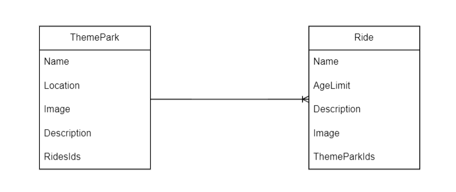

# Themepark-backend

## Date : 2/28/2024

### Made By:  
##  Fatima Fouad - Ali Albanna - AAmir Saleh

### **_Description_**
Theme Parks is a website where the user can view theme parks and their rides. with the option of deleting and updating rides and them parks.

---
### **Frontend Repo Link:**
#####  Link: [Frontend](https://github.com/Ali000/Themepark)
---
### Screenshots:
## ERD:
## 

### Technologies used

- [x] VSCode (Editor for Writing the Code)
- [x] Node JS (Backend)
- [x] Express (API Calls)
- [x] MongoDB (Databse)
- [x] JavaScript (Functionality)
- [x] Drawio (ERD for the database)

---
### What we have learned:

- [x] Connecting NodeJS with React JS..
---
### What we are most proud of is :
## Creating a ride:
```
async function createRide(req, res) {
    try {
        const  ride = await Ride.create(req.body)
        const themeParkId = req.body.themeParkId
        const themePark = await ThemePark.findById(themeParkId)
        themePark.ridesIds.push(ride.id)
        await themePark.save()
        res.send('Ride Created')
    } catch (err) {
        console.log('This is the error!!!' + err)
        res.send({ errorMsg: err.message })
    }
}
```
---
### **_Credits_**

##### Drawio: [Draw](https://app.diagrams.net/)

---
### Future plans:

- [ ] Improve the design.
- [ ] Add more functionalities.

